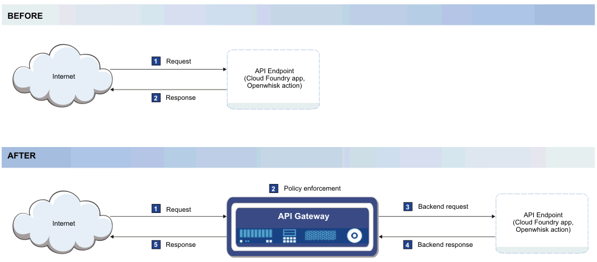

---

copyright:
  years: 2017
lastupdated: "2017-06-07"

---

{:new_window: target="_blank"}
{:shortdesc: .shortdesc}
{:screen: .screen}
{:codeblock: .codeblock}
{:pre: .pre}

# Overview
{: #index}

You can manage APIs natively in {{site.data.keyword.Bluemix}} whether they're associated with any Cloud Foundry runtime, an {{site.data.keyword.openwhisk_short}} action, or a growing list of integrated {{site.data.keyword.Bluemix_notm}} services such as the {{site.data.keyword.appconserviceshort}} service. Managing your APIs allows you to control usage, increase adoption and track statistics.

API management is integrated into the following {{site.data.keyword.Bluemix_notm}} services:
* Cloud Foundry applications
* IBM App Connect
* OpenWhisk action APIs

As displayed in the following diagram, API management works by inserting a fast and lightweight gateway in front of existing cloud endpoints. The gateway, referred to as the API Gateway in the diagram, is responsible for responding to incoming API calls from applications. The API Gateway provides a comprehensive set of API policies for security, traffic management, mediation, acceleration, and non-HTTP protocol support.

When you expose an API, you make it available for other people to use it. This often means giving the users of the API limited access to information that is on servers that you maintain. This access allows a more seamless customer experience for the end user because they can access the information directly from the current interface.

There are times when you want to control some of the activity on your servers. For example, if there are too many API requests on a server in a short amount of time, the server can become overloaded and shut down. To avoid a situation like this, you can manage the rate of the API calls by using API management. The light gateway that is attached to the API tracks the number of calls to your API and enforces limits on how many calls it accepts. API management also allows you to track the volume of API calls from a particular source by recording its API key. The API key is a unique string that the API development team provides to the API consuming team that enables the API developer to monitor statistics about the calls that the consuming team requests are generating.  

The following features are available with {{site.data.keyword.Bluemix_notm}} API management:
## API analytics
{: #basic_analytics notoc}

If you want to monetize the use of your APIs, you can use the analytics feature to track call usage. You can also monitor usage to understand how your APIs are being used so you can make informed decisions about how to update your APIs to increase adoption.

You can view the following statistics about your APIs:
* The number of responses and average response time in the last hour, or your specified time interval.
* The number of API calls per minute.
* The last 100 responses.

API management uses the {{site.data.keyword.Bluemix_notm}} logging and metrics services to store and display information that is generated during API invocations. Only a subset of the data that is available is presented in the API management console for debugging purposes. To view additional data and log information, see [Kibana logs ](https://logmet.ng.bluemix.net/app/#/kibana){: new_window}. You must be logged in to your {{site.data.keyword.Bluemix_notm}} account for the link to resolve correctly to your account. For more information about the {{site.data.keyword.Bluemix_notm}} logging services, see [Monitoring and logging](../../monitor_log/monitoringandlogging.html#monitoringandlogging){: new_window}.

## Rate limiting by subscription (API key)
{: #rate_limit notoc}

You can enforce a rate limit to manage the number of calls that applications can make to your APIs. You can specify a rate limit so that only a permitted number of calls are made per second, minute, hour, so that for instance, your backend is not overloaded. You can set this either by overall API or by each API key.

## OAuth
{: #oauth notoc}

To stop unwanted usage of the data you supply, you can ensure that only users with the correct authentication can access your APIs. You can control access to your APIs through the OAuth authorization standard. OAuth is a token-based authorization protocol that allows third-party websites or applications to access user data without requiring the user to share personal information.

## CORS
{: #cors notoc}

CORS allows embedded scripts in a web page to call the API across domain boundaries. This benefits the user of the API because it allows the API to retrieve the information from another domain when it is called by the API. Without enabling CORS, any content retrieval is limited to the same domain as the originating request. For more information about CORS, and how to implement it, see [HTTP access control (CORS) ](https://developer.mozilla.org/en-US/docs/Web/HTTP/Access_control_CORS.html){: new_window}.

## Command-line interface
{: #cli notoc}

If you prefer running frequent tasks by using scripting, then you can also run many of the API management tasks by extending the your Bluemix command line with the API management plugin. The command-line interface can access the APIs in your Bluemix organization. 

## Additional API management options
{: #add_mgt_options notoc}

These features for API management are available in the API Management tab of your Cloud Foundry, {{site.data.keyword.openwhisk_short}}, or App Connect Dashboard. For more complex management solutions, you can upgrade to the full {{site.data.keyword.apiconnect_full}} service to access more features such as detailed analytics, packaging strategies for your APIs, or a developer portal to socialize APIs. See [Getting started with API Connect](https://console.ng.bluemix.net/docs/services/apiconnect/index.html){: new_window} for more information about the {{site.data.keyword.apiconnect_full}} service.

For more information about upgrading your APIs that you are managing in {{site.data.keyword.Bluemix_notm}} to the {{site.data.keyword.apiconnect_short}} service, see [Accessing more API management features](upgrade.html).

