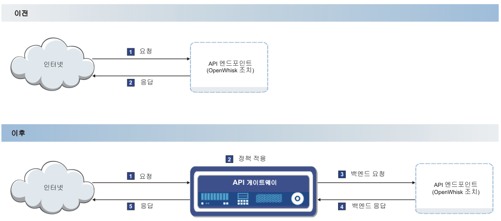

---

copyright:
  years: 2017
lastupdated: "2017-04-12"

---

{:new_window: target="_blank"}
{:shortdesc: .shortdesc}
{:screen: .screen}
{:codeblock: .codeblock}
{:pre: .pre}

# 개요
{: #index}

{{site.data.keyword.openwhisk_short}} 조치 또는 통합 {{site.data.keyword.Bluemix_notm}} 서비스(예: {{site.data.keyword.appconserviceshort}} 서비스)의 목록이 늘어남과 연관성이 있는지 여부와 상관없이 {{site.data.keyword.Bluemix}}에서 기본적으로 API를 관리할 수 있습니다. API를 관리함으로써 사용자는 사용량을 제어하고 선택사양을 늘리며 통계를 추적할 수 있습니다. 

다음 다이어그램에 표시된 대로 API 관리는 기존의 클라우드 엔드포인트 앞에 고속의 경량 게이트웨이를 삽입함으로써 작동됩니다. 다이어그램에서 API 게이트웨이라고 하는 게이트웨이는 애플리케이션에서 수신되는 API 호출에 대한 응답을 담당합니다. API 게이트웨이는 보안, 트래픽 관리, 중개, 가속화 및 비-HTTP 프로토콜 지원을 위한 종합적 API 정책 세트를 제공합니다. 

API를 노출하면 이를 다른 사용자가 사용할 수 있습니다. 이는 종종 유지보수 중인 서버에 있는 정보에 대한 제한된 액세스 권한을 API 사용자에게 부여함을 의미합니다. 현재 인터페이스에서 직접 정보에 액세스할 수 있으므로, 이러한 액세스 권한은 일반 사용자에게 보다 완벽한 고객 환경을 제공합니다. 

사용자가 서버에서 일부 활동을 제어하고자 할 때가 있습니다. 예를 들어, 단기간에 서버에서 너무 많은 API 요청이 있으면 서버에 과부하가 걸려서 시스템이 종료될 수 있습니다. 이러한 상황을 피하기 위해 API 관리를 사용하여 API 호출의 속도를 관리할 수 있습니다. API에 연결된 경량 게이트웨이는 API에 대한 호출의 수를 추적하고 허용되는 호출의 수를 제한할 수 있습니다. 또한 API 관리를 사용하면 사용자가 해당 API 키를 기록하여 특정 소스에서 API 호출의 볼륨을 추적할 수도 있습니다. API 키는 API 개발 팀이 API 이용 팀에 제공하는 고유 문자열이며, API 개발자는 이를 사용하여 이용 팀 요청이 생성하는 호출에 대한 통계를 모니터할 수 있습니다.   

다음 기능을 {{site.data.keyword.Bluemix_notm}} API 관리에서 사용할 수 있습니다. 
## API 분석
{: #basic_analytics notoc}

API의 사용량을 금액으로 환산하려면 호출 사용량을 추적하는 분석 기능을 사용할 수 있습니다. 또한 사용량을 모니터하여 API가 사용되는 방법을 파악할 수도 있으며, 이에 따라 API를 업데이트하여 선택사양을 늘리는 방법에 대해 잘 알고 의사결정을 내릴 수 있습니다. 

API에 대한 다음 통계를 볼 수 있습니다. 
* 마지막 시간 또는 지정된 기간의 응답 수와 평균 응답 시간. 
* 분당 API 호출의 수. 
* 마지막 100개 응답. 

## 구독에 의한 속도 제한(API 키)
{: #rate_limit notoc}

속도 제한을 적용하여 애플리케이션이 API에 대해 작성할 수 있는 호출의 수를 관리할 수 있습니다. 초, 분, 시간당 허용된 수의 호출만 작성되도록 속도 제한을 지정할 수 있습니다(예: 백엔드에 과부하가 걸리지 않도록). 전체 API 또는 각 API 키별로 이를 설정할 수 있습니다. 

## OAuth
{: #oauth notoc}

제공된 데이터의 원하지 않는 사용이 멈추도록, 올바른 권한을 지닌 사용자만 API에 액세스함을 보장할 수 있습니다. OAuth 권한 부여 표준을 통해 API에 대한 액세스를 제어할 수 있습니다. OAuth는 사용자의 개인 정보 공유를 요구하지 않고 써드파티 웹 사이트나 애플리케이션이 사용자 데이터에 액세스할 수 있도록 허용하는 토큰 기반 권한 부여 프로토콜입니다. 

## CORS
{: #cors notoc}

CORS는 웹 페이지의 임베디드 스크립트가 도메인 경계에서 API를 호출할 수 있도록 허용합니다. API에 의해 호출될 때 API가 다른 도메인의 정보를 검색할 수 있으므로, 이는 API 사용자에게 유용합니다. CORS를 사용하지 않으면 컨텐츠 검색이 원래 요청과 동일한 도메인으로 제한됩니다. CORS 및 이의 구현 방법에 대한 자세한 정보는 [HTTP 액세스 제어(CORS) ](https://developer.mozilla.org/en-US/docs/Web/HTTP/Access_control_CORS.html){: new_window}를 참조하십시오. 

## 추가 API 관리 옵션
{: #add_mgt_options notoc}

API 관리에 대한 이러한 기능은 App Connect 대시보드 또는 {{site.data.keyword.openwhisk_short}}의 API 관리 탭에서 사용 가능합니다. 보다 복잡한 관리 솔루션에 대해서는 전체 {{site.data.keyword.apiconnect_full}} 서비스로 업그레이드하여 추가 기능(예: 상세 분석, API의 패키징 전략 또는 API를 소셜 네트워크에서 공유하기 위한 개발자 포털)에 액세스할 수 있습니다. {{site.data.keyword.apiconnect_full}} 서비스에 대한 자세한 정보는 [API Connect 시작하기](https://console.ng.bluemix.net/docs/services/apiconnect/index.html){: new_window}를 참조하십시오. 

{{site.data.keyword.Bluemix_notm}}에서 관리 중인 API를 {{site.data.keyword.apiconnect_short}} 서비스로 업그레이드하는 자세한 정보는 [추가 API 관리 기능에 액세스](upgrade.html)를 참조하십시오. 

